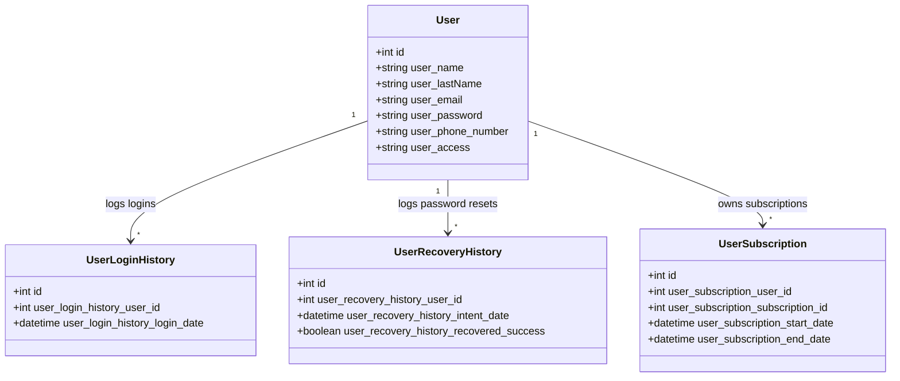

# Tenant Area Implementation Plan

This document outlines the design, architecture, and implementation plan for the **Tenant Area (My Account)** within the Daatio application. This area provides store operators (tenants) with a central dashboard to manage their personal profile, update security credentials, view active subscriptions, and audit security histories (such as login histories and active sessions/devices).

---

## 1. Objectives & Features
* **Profile Management:** Allow operators to update their personal details (First Name, Last Name, Phone Number, Email Address).
* **Security Settings:** Facilitate secure password updates with current password verification.
* **Subscription Management:** Display current plan status, renewal history, and active payment statuses.
* **Security Audit Logs:** List user login history, recovery history, and identify active devices/browsers.

---

## 2. User Interface Design

The Tenant Area will be designed with a modern tabbed dashboard interface following the existing dark mode/glassmorphism aesthetics:

```
+-------------------------------------------------------------+
|  Daatio Dashboard  >  My Account Settings                    |
+-------------------------------------------------------------+
|                                                             |
|   [ Profile ]  [ Security & Logs ]  [ Subscription ]        |
|                                                             |
|   +-----------------------------------------------------+   |
|   |  Profile Information                                |   |
|   |  First Name:  [ John              ]                 |   |
|   |  Last Name:   [ Doe               ]                 |   |
|   |  Email:       [ john@example.com  ]                 |   |
|   |  Phone:       [ +1 234 567 890    ]                 |   |
|   |                                                     |   |
|   |  [ Save Changes ]                                   |   |
|   +-----------------------------------------------------+   |
|                                                             |
+-------------------------------------------------------------+
```

### Views
1. **`tenant/profile.blade.php` (Profile Tab):**
   * Edit form for `user_name`, `user_lastName`, `user_phone_number`, `user_email`.
   * Real-time field validation feedback.
2. **`tenant/security.blade.php` (Security & Logs Tab):**
   * Form to update `password`.
   * Interactive table listing user login history: Date/Time, Status, Browser, OS, IP Address.
   * Recovery history logs: Date/Time, Recovery Status.
3. **`tenant/subscription.blade.php` (Subscription Tab):**
   * Premium plan card showcasing current subscription limits (max stores, active duration, expiration date).
   * Payment list details (date, payment reference, method, amount, status).

---

## 3. Database & Model Architecture

The implementation leverages existing models and schemas in the Daatio system:



### Table Structure Enhancements
To support device auditing on the shared cPanel environment, we will add tracking columns to `user_login_history` via a new migration:
* `user_login_history_ip` (string, nullable) - Operator IP address.
* `user_login_history_user_agent` (text, nullable) - Browser user agent.

---

## 4. Route Map & Controllers

The backend routing will be organized under the `web` middleware requiring authentication.

### Routes (`routes/web.php`)
```php
use App\Http\Controllers\Tenant\ProfileController;
use App\Http\Controllers\Tenant\SecurityController;
use App\Http\Controllers\Tenant\SubscriptionController;

Route::middleware(['auth'])->prefix('account')->name('account.')->group(function () {
    // Profile Management
    Route::get('/profile', [ProfileController::class, 'edit'])->name('profile.edit');
    Route::put('/profile', [ProfileController::class, 'update'])->name('profile.update');

    // Security & Audit Logs
    Route::get('/security', [SecurityController::class, 'index'])->name('security.index');
    Route::put('/security/password', [SecurityController::class, 'updatePassword'])->name('security.password');
    Route::post('/security/logout-other-devices', [SecurityController::class, 'logoutOtherDevices'])->name('security.logout_devices');

    // Subscription & Payments
    Route::get('/subscription', [SubscriptionController::class, 'index'])->name('subscription.index');
});
```

### Controller Design
1. **`ProfileController`:**
   * `edit()`: Return the profile view pre-populated with authenticated user state.
   * `update()`: Validate and persist changes. If email is updated, prompt email verification check.
2. **`SecurityController`:**
   * `index()`: Load paginated `userLoginHistories` and parse user agents (using a lightweight parser library or custom logic to render OS/Browser labels).
   * `updatePassword()`: Validate old password matches current bcrypt hash, then store new password.
   * `logoutOtherDevices()`: Leverage Laravel's `Auth::logoutOtherDevices($currentPassword)` to invalidate other active sessions.
3. **`SubscriptionController`:**
   * `index()`: Retrieve active user subscription details, plans, and historic subscription payments logs.

---

## 5. Security Protocols

* **Current Password Verification:** Any password change request must supply the current password.
* **Email Uniqueness:** Standard email validation (`unique:user,user_email,{auth_id}`) to prevent duplication conflicts.
* **Authentication Audits:** Login logs must record IP address and device descriptions upon every authentication hook.
